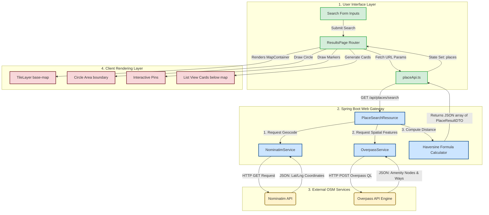

# Geospatial Concepts & Architecture Explanation

This document provides a detailed, entry-level explanation of geospatial technologies (GIS, PostGIS, Spatial SQL, and Leaflet), how they work together, and how OpenStreetMap is used in this application to resolve search queries and render interactive maps.

---

## 🌎 1. Core Geospatial Technologies

### A. Geographic Information System (GIS)

**What it is**: A system designed to capture, store, manipulate, analyze, manage, and present spatial or geographic data.

- **Simple Analogy**: Think of standard data as a spreadsheet of names and ages. GIS is that spreadsheet combined with a map, linking each person to their exact coordinate on Earth.
- **Coordinates & Projections**:
  - **WGS84 (EPSG:4326)**: A coordinate system that uses spherical latitude and longitude (in degrees). E.g., `(10.7716, 76.3762)`. This is what GPS, OpenStreetMap, and our backend services use.
  - **Web Mercator (EPSG:3857)**: A projection system that flattens the spherical Earth into a flat 2D grid (in meters). This flat grid is what visual maps (Leaflet, Google Maps, OpenStreetMap tiles) use to draw maps without distortion.
- **Role in Application**: Defines the core problem structure—converting human addresses to coordinate tuples and retrieving neighboring features within a circular boundary.

---

### B. PostGIS

**What it is**: A spatial database extender for the PostgreSQL relational database. It adds support for geographic objects, allowing spatial queries to be run in SQL.

- **Why we need it**: Standard databases do not understand shapes, distances, or coordinate bounds. They only do simple number or text comparisons (e.g. `WHERE age > 18`). PostGIS adds spatial datatypes (`GEOMETRY` and `GEOGRAPHY`) and spatial indexes.
- **Spatial Indexing (GIST)**: Rather than scanning every coordinate in the database one-by-one, PostGIS creates a **Bounding Box Tree (R-Tree / GIST index)**. This divides the world into nested rectangular blocks, allowing the database to search millions of coordinates in milliseconds.
- **Example**:
  ```sql
  -- Find all restaurants within 5000 meters of a coordinate
  SELECT name FROM restaurants
  WHERE ST_DWithin(geom, ST_MakePoint(76.3762, 10.7716)::geography, 5000);
  ```
- **Role in Application**: Although our search feature is currently _stateless_ (fetching live data directly from OSM), the database configures PostGIS to support storing coordinates and geometry boundaries internally if we decide to cache or log searches.

---

### C. Spatial SQL

**What it is**: SQL queries extended with spatial functions (prefixed with `ST_` for "Spatial Type") to perform spatial operations.

- **Key Functions**:
  - `ST_MakePoint(longitude, latitude)`: Creates a spatial point object from numerical coordinates.
  - `ST_Distance(geom1, geom2)`: Computes the exact shortest distance between two geographic features.
  - `ST_Contains(polygon, point)`: Checks if a boundary contains a specific coordinate (e.g., "Is this delivery coordinate inside our delivery circle?").
  - `ST_Buffer(geom, radius)`: Creates a circular polygon area of a specific size around a point.

---

### D. Leaflet

**What it is**: A lightweight, open-source JavaScript library for mobile-friendly interactive maps.

- **Tile Layers**: Leaflet loads map visuals as small $256 \times 256$ pixel images called **tiles**. As you pan or zoom, Leaflet requests the specific images for that region and stitches them together seamlessly.
- **Features**:
  - **Marker**: A pin placed at a specific coordinate: `L.marker([lat, lng])`.
  - **Circle**: A boundary drawn around a center with a radius: `L.circle([lat, lng], { radius: 5000 })`.
  - **Popup**: Interactive dialog boxes that appear when clicking markers.
- **Role in Application**: Renders the map container on the frontend Results page, drawing the search radius boundary circle and pinning markers for each place retrieved.

---

## 🛠️ 2. Code Walkthrough: How it Works in Our App

### A. Geocoding: Text to Coordinates

In **[NominatimService.java](file:///d:/LXI-2/PostGIS_project/PostGIS/src/main/java/com/lxisoft/aps/service/NominatimService.java)**, the backend contacts the OpenStreetMap Nominatim server:

```java
String url = UriComponentsBuilder.fromHttpUrl("https://nominatim.openstreetmap.org/search")
  .queryParam("q", String.format("%s, %s, %s", locality, district, state))
  .queryParam("format", "json")
  .queryParam("limit", 1)
  .toUriString();

// Nominatim returns a JSON array. We extract the first object:
Double lat = Double.valueOf(rootNode.get(0).get("lat").asText());

Double lng = Double.valueOf(rootNode.get(0).get("lon").asText());

```

- **What it does**: Takes the user's text inputs (e.g., "Ottapalam, Palakkad, Kerala") and geocodes it into the coordinates `(10.7716942, 76.3762414)`.

---

### B. Proximity Query: Fetching Nearby Places

In **[OverpassService.java](file:///d:/LXI-2/PostGIS_project/PostGIS/src/main/java/com/lxisoft/aps/service/OverpassService.java)**, the backend runs a search around that coordinate:

```java
String query = String.format(
  "[out:json][timeout:25];" +
  "(" +
  "  node[\"amenity\"=\"%s\"](around:%d, %f, %f);" +
  "  way[\"amenity\"=\"%s\"](around:%d, %f, %f);" +
  ");" +
  "out body;" +
  ">;" +
  "out skel qt;",
  amenity,
  radiusMetres,
  lat,
  lng,
  amenity,
  radiusMetres,
  lat,
  lng
);

```

- **What it does**: Queries the OpenStreetMap database to retrieve all elements matching the selected category (e.g., `restaurant`) within the radius (e.g. `5000` meters) of the geocoded coordinates.

---

### C. Distance Calculation (Haversine Formula)

In **[PlaceSearchResource.java](file:///d:/LXI-2/PostGIS_project/PostGIS/src/main/java/com/lxisoft/aps/web/rest/PlaceSearchResource.java)**, the backend computes the distance between the search center and each result:

```java
private double calculateDistance(double lat1, double lon1, double lat2, double lon2) {
  double earthRadius = 6371000; // meters
  double dLat = Math.toRadians(lat2 - lat1);
  double dLon = Math.toRadians(lon2 - lon1);
  double a =
    Math.sin(dLat / 2) * Math.sin(dLat / 2) +
    Math.cos(Math.toRadians(lat1)) * Math.cos(Math.toRadians(lat2)) * Math.sin(dLon / 2) * Math.sin(dLon / 2);
  double c = 2 * Math.atan2(Math.sqrt(a), Math.sqrt(1 - a));
  return earthRadius * c;
}

```

- **What it does**: Since the Earth is a sphere, you cannot use simple 2D geometry ($a^2 + b^2 = c^2$). The Haversine formula determines the shortest distance between two points on the sphere.

---

### D. Rendering the Map and Circle

In **[ResultsPage.tsx](file:///d:/LXI-2/PostGIS_project/PostGIS/src/main/webapp/app/modules/geo/ResultsPage.tsx)**, the frontend draws the map components using React Leaflet:

```tsx
<MapContainer center={[centerLat, centerLng]} zoom={13} style={{ height: '100%', width: '100%' }}>
  <TileLayer
    url="https://{s}.tile.openstreetmap.org/{z}/{x}/{y}.png"
    attribution='&copy; <a href="https://www.openstreetmap.org/copyright">OpenStreetMap</a> contributors'
  />
  {/* Draws the circular search boundary */}
  <Circle
    center={[centerLat, centerLng]}
    radius={radiusMetres}
    pathOptions={{ color: '#007bff', fillColor: '#007bff', fillOpacity: 0.15 }}
  />
  {/* Places marker pins for each search result */}
  {places.map(place => (
    <Marker key={place.osmId} position={[place.lat, place.lng]}>
      <Popup>
        <strong>{place.name}</strong>
        <br />
        {place.street || 'Address not listed'}
      </Popup>
    </Marker>
  ))}
</MapContainer>
```

- **What it does**:
  1. Instantiates a map viewport centered at the search coordinate.
  2. Loads visual map terrain tiles from `openstreetmap.org`.
  3. Draws a circular boundary of the specified radius.
  4. Places pins (`Marker`) at the exact coordinates of found places.

---

## 📈 3. Architecture & Data Flow Graph

This graph details the sequence of layers, API calls, and processes starting from user input to rendering the results on the map.



---

## 🗺️ 4. How OpenStreetMap (OSM) Works in Our Application

**OpenStreetMap (OSM)** is a collaborative project to create a free, editable map of the world. It behaves like a wiki—anyone can contribute, correct, or add data.

### The OSM Data Model

The map data is structured into three basic types:

1. **Nodes (Points)**: Represents a single coordinate on Earth. Used for shops, individual trees, monuments, or restaurants. Contains an ID, Latitude, and Longitude.
2. **Ways (Lines / Polygons)**: An ordered list of nodes. Represents streets (lines) or boundaries of buildings, parks, and lakes (polygons).
3. **Relations**: Groups of nodes, ways, and other relations. Used for complex routes (bus paths), boundaries (districts/states), or multipolygons.

Each element has key-value metadata tags. E.g., a node representing a hospital has:

- `amenity` = `hospital`
- `name` = `General Hospital`
- `addr:city` = `Palakkad`

### How We Leverage OSM

- **Nominatim Geocoding**: When looking for "Ottapalam, Palakkad", Nominatim searches OSM's index of administrative relations (cities, states, countries) and returns the center node coordinate.
- **Overpass API Engine**: Instead of downloading the massive multi-terabyte global OSM database, we use the Overpass API, a read-only query service designed to fetch small subsets of OSM data based on spatial queries.
- **Drawing Map Tiles**: The map tiles you see (e.g. roads, mountains, rivers) are generated by drawing graphics on top of the OSM node and way data, served to the browser dynamically via Leaflet.
